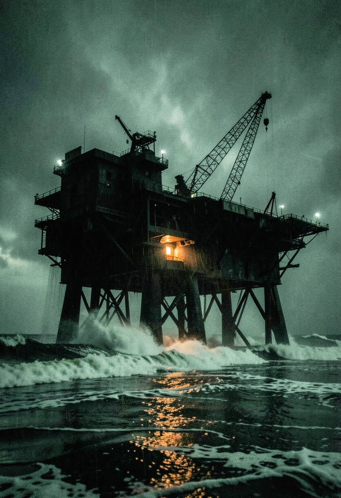

# RUMORE DI FONDO

**Un gioco di ruolo di recupero industriale. 2039, Adriatico settentrionale.**



Nel 2039 è stato costruito più di quanto si riesca a tenere acceso. Piattaforme, depositi, data center sommersi: chiusi, sigillati, assicurati, dimenticati. Tu sei un **Corvo** - uno che entra a contratto, viene pagato alla consegna, e non ha nessuno che venga a prenderlo se resta dentro.

La prima missione è **Profondo 7**: un caveau di dati raffreddato ad acqua di mare che ha smesso di rispondere trentuno ore fa. Quattro custodi a bordo, e il portello chiuso dall'interno. Niente di soprannaturale, mai: ogni cosa strana ha una spiegazione tecnica o umana, e alla fine arriva.

Si gioca **al tavolo** con quattro d6 e due file di caselle — servono [REGOLE.md](REGOLE.md) e [CONDURRE.md](CONDURRE.md), nessuno dei due con spoiler — oppure **in solitaria** con l'applicazione locale in questa cartella, in cui il game master è una sessione di Claude Code.

---

## Il sistema

Si tira una manciata di **d6** e si legge **solo il dado più alto**.

| Dado più alto | Esito | |
|---|---|---|
| **6** | Pulito | Funziona come volevi. Nessun costo. |
| **4–5** | Sporco | Funziona, ma c'è un prezzo. |
| **1–3** | Rumore | Non funziona. Statica +1, e il posto reagisce. |
| **6 6** | Limpido | Funziona, e ti resta in mano un vantaggio. |

Base 1d6, più un dado se il tuo **Ruolo** c'entra, uno se hai l'**Attrezzo** giusto, uno se hai un **Vantaggio** concreto. Massimo quattro; puoi **Forzare** per un quinto, e lo paga il gruppo.

Due tracce al centro del tavolo: la **Statica** (0–6) è il volume che stai facendo e il GM la *spende* per farti male; l'**Allarme** (0–4) è l'ora, non scende mai, e ogni tacca cambia il posto in modo irreversibile.

Niente punti ferita. Quattro **Condizioni**, e a ogni conseguenza la stessa domanda: la paghi tu con il corpo, o la paga la squadra con un punto di Statica?

Sono tutte le regole che ci sono: il testo completo sta in **[REGOLE.md](REGOLE.md)** e si legge in cinque minuti.

---

## Setup

Serve **Python 3.8+**. Nessuna dipendenza: il server usa solo la libreria standard.

```bash
python server.py
```

Poi apri **http://127.0.0.1:7327**.

| Rotta | |
|---|---|
| `/` | Copertina, e il tasto per riprendere la partita in corso |
| `/regole` | Il regolamento completo, da leggere |
| `/nuova` | Scelta fra i cinque personaggi pregenerati |
| `/plancia` | Il gioco |

**Per le illustrazioni** *(facoltative)* servono due variabili d'ambiente, una volta sola. `setx` vale dai processi successivi, quindi riapri il terminale dopo:

```bash
setx CLOUDFLARE_ACCOUNT_ID "il-tuo-account-id"
setx CLOUDFLARE_API_TOKEN "il-tuo-token"
```

Non fare `echo` del token. La skill che le genera, **`flux-image`**, è inclusa in `.claude/skills/` e funziona subito dopo il clone.

---

## Il giro di gioco in solitaria

1. Il giocatore scrive la mossa nella casella in fondo alla plancia e preme **Invia al GM** *(o Ctrl+Invio)*. Finisce in `mosse.jsonl`.
2. `python attesa.py` è in ascolto, si sblocca e sveglia il GM.
3. Il GM tira, aggiorna le tracce, genera l'illustrazione e scrive la scena in `partita.json`.
4. `python build.py` rigenera `plancia.html`.
5. La pagina interroga `/versione` ogni 1,5 s e si ricarica da sola. Se stai scrivendo aspetta e ti offre un tasto, invece di strapparti il testo di mano.

Servono due terminali: uno per `server.py`, uno per `attesa.py` fra una mossa e l'altra.

Chi fa il GM scrive le scene con la voce di [STILE.md](STILE.md), le illustra secondo [STILE-IMMAGINI.md](STILE-IMMAGINI.md) e tiene aperto il dossier della missione — [TRAMA.md](TRAMA.md), che contiene tutte le risposte.

La plancia mostra il flusso della partita — narrazione, dialoghi, tiri, eventi, indizi, immagini — con in coda il riquadro **Tocca a te**, dove ogni strada possibile ha **i dadi già dichiarati**. A lato: scheda, squadra, zone scoperte, indizi, e dadi/timer/taccuino locali al browser.

---

## Documentazione

| File | Per chi |
|---|---|
| [REGOLE.md](REGOLE.md) | Il sistema completo. Cinque minuti |
| `CLAUDE.md` | Istruzioni che Claude Code carica da solo: chi è, cosa legge, cosa non rivela |
| [CONDURRE.md](CONDURRE.md) | Chi conduce: descrivere a voce, dosare le tracce, i PNG, gli errori tipici. Senza spoiler |
| [TRAMA.md](TRAMA.md) | ⚠️ Bibbia della missione: **contiene tutte le risposte** |
| [STILE.md](STILE.md) | Voce e lessico, per giocare per iscritto |
| [STILE-IMMAGINI.md](STILE-IMMAGINI.md) | Stile visivo e prompt canonici |
| [PERSONAGGIO.md](PERSONAGGIO.md) | Scheda estesa del personaggio giocante |
| [CRONACA-esempio.md](CRONACA-esempio.md) | Modello di cronaca, da copiare in `CRONACA.md` |

---

## Il codice

| File | |
|---|---|
| `server.py` | Server locale: pagine, mosse, avvio partita |
| `build.py` | Inietta lo stato nel template e scrive `plancia.html` |
| `attesa.py` | Blocca finché non arriva una mossa, poi la stampa |
| `plancia.template.html` | Modello della plancia, con `__STATO__` al posto dei dati |
| `apertura.json` · `personaggi.json` | Scena iniziale e i cinque Corvi |
| `tira.ps1` | Tiratore da riga di comando (PowerShell), tiene anche le tracce |
| `rumore-di-fondo.html` | Il manuale in una pagina sola, apribile con un doppio clic |
| `.claude/skills/` | `flux-image`, inclusa nel repository |
| `immagini/` | Ritratti, copertina, illustrazioni |

```bash
./tira.ps1 -Ruolo -Attrezzo -Etichetta "Aprire il quadro"
./tira.ps1 -Spendi 2      # il GM spende Statica
./tira.ps1 -Statica       # mostra le tracce
```

⚠️ Le tracce di `tira.ps1` e quelle della plancia sono **due contatori distinti** e non si sincronizzano.

Per portare il gioco a un tavolo senza far girare niente basta `rumore-di-fondo.html`, che è il manuale completo in una pagina sola.

**Non versionati**, perché sono lo stato di una partita e non il gioco: `CRONACA.md`, `partita.json`, `mosse.jsonl`, `tracce.json`, e `plancia.html` che si rigenera.

---

## Avvertenze

Contenuti: morti sul lavoro, corpi, annegamento, spazi chiusi e sommersi, colpa e responsabilità. Nessuna violenza esplicita — il gioco guarda sempre l'oggetto accanto.

---

## Licenza

Due licenze, perché ci sono due cose diverse:

- **Il codice** — server, build, tiratore, template, skill — è **[MIT](LICENSE)**. Fanne quello che vuoi.
- **Il gioco** — regolamento, missione, personaggi, testi e illustrazioni — è **CC BY-NC-SA 4.0**: puoi condividerlo, tradurlo, scrivere missioni nuove e adattarlo, citando la fonte e mantenendo la stessa licenza, ma non venderlo.

**Condurlo a un tavolo non richiede alcun permesso.** È uso, non distribuzione.

I dettagli, incluse le note sulle illustrazioni generate e sui caratteri tipografici, stanno in **[LICENZA-GIOCO.md](LICENZA-GIOCO.md)**.
